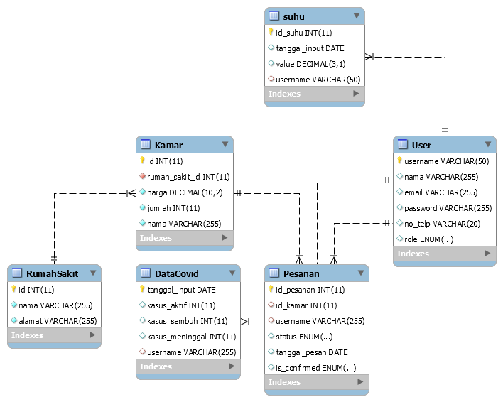

# Sistem Tracking Corona
...adalah aplikasi GUI yang dibangun dengan Python. Dalam aplikasi ini, terdapat dua jenis pemain utama, yaitu pengguna dan admin. Pengguna dapat melakukan hal-hal seperti menambahkan suhu mereka per hari, melakukan pemesanan kamar di suatu RS, dll. Sedangkan, Admin dapat melakukan verifikasi pesanan, penambahan RS, dan input data harian Covid-19.

## Cara Menjalankan Aplikasi
Jalankan VirusTrack.bat

## Daftar Modul
1. Autentikasi login - 13519221 Allief Nuriman

2. Pemesanan rumah sakit - 13519207 Rafidika Samekto

3. Suhu harian - 13519192 Gayuh Tri Rahutami

4. Data rumah sakit - 13519180 Karel Renaldi

## Daftar tabel basis data
